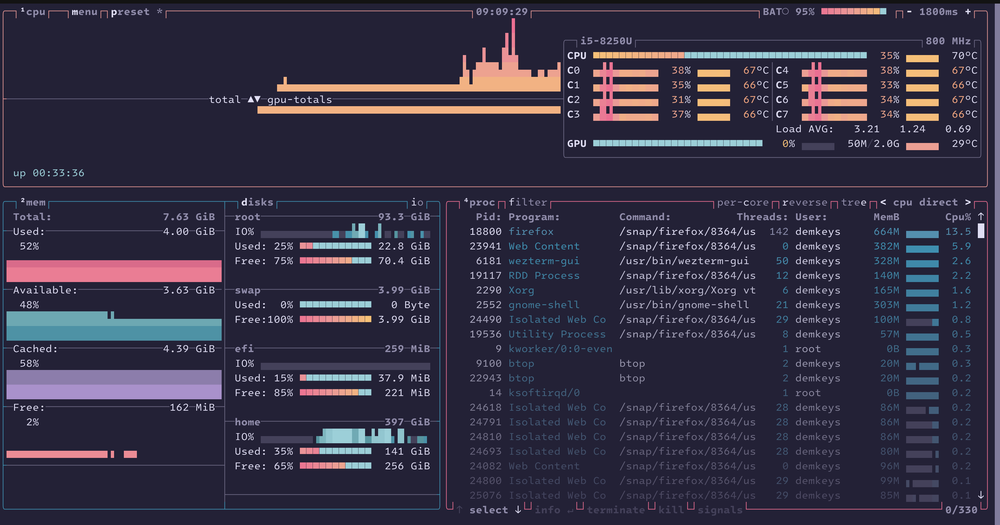
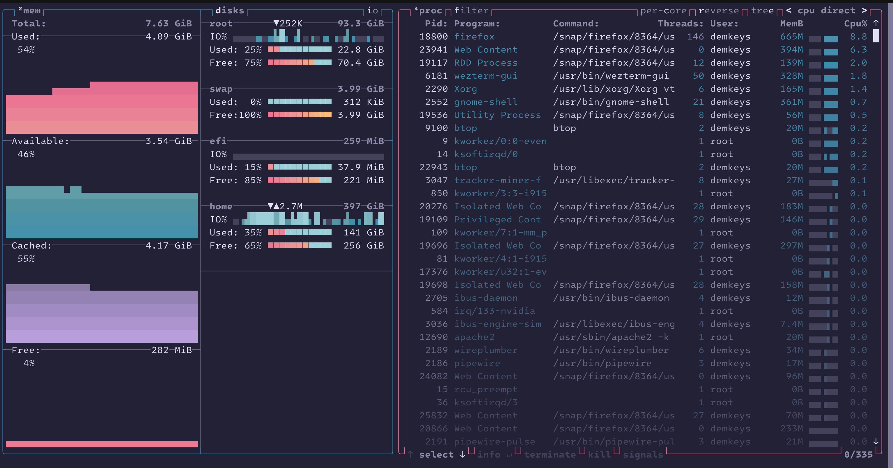
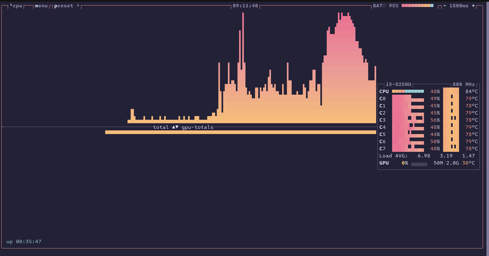
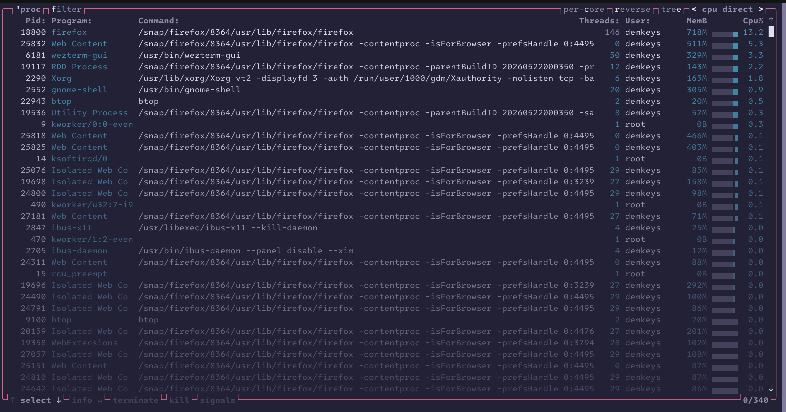

### Description
This is a slight variation of the [rose-pine-moon](https://github.com/rose-pine/btop) theme for btop, modified to include gradients in graphs.




---
### Setup
- Copy [theme file](./rose-pine-moon-custom.theme) to ```~/.config/btop/themes/```.
- Open btop settings and select the theme from the list. Since you copied the file into themes directory the theme should show up in the list.


